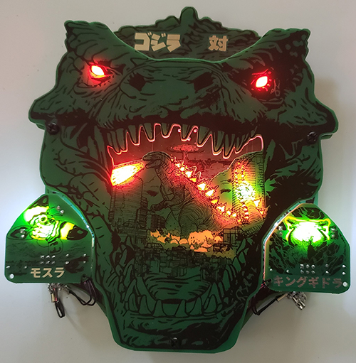

# G0dzilla VS Badge

Welcome to the G0dzilla VS Badge website.

This badge was designed for the DEFCON 32 security conference in August 2024.

On this page you will find all the details about this badge including an operations guide, an assembly guide (for those building the badge from a kit), and a detailed review of the art and cicuit design and pcb design.

-- [@alt_bier](https://twitter.com/alt_bier)  - [My Contact Info](https://gowen.net/about)

---

# Details

The badge theme was based on the fact that I love Godzilla and the movie Godzilla Minus One that was released in 2023 inspired me to do something with this theme.

Since I make badges I figured this would be my medium.  However, I made a previous badge that had Godzilla on it so if I was going to revisit this theme it was going to have to be bigger and better.

Having Godzilla fight different monsters that can be changed out since they are addons was the idea I had to bring a Godzilla badge to the next level.

This badge includes an ESP32 Wemos Lolin32 development board, eight neopixel addressable LEDs, eight traditional white LEDs, and four capacitive touch areas, four female SAO connectors (two of which are powered), and three PCBs stacked together, all powered by a LIPO battery.  And that is just the main badge!

[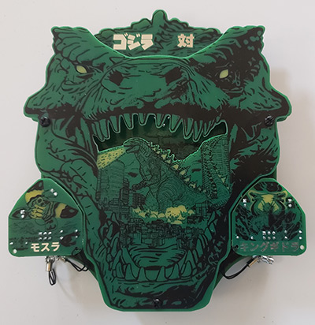](images/BadgeAssembled01.jpg)
[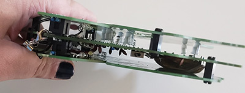](images/BadgeAssembled02.jpg)

This badge also includes four Shitty Addons (SAOs) which are the monsters that Godzilla will fight.  These addons each have two traditional white LEDs and a male hooded SAO connector.
The SAOs also utilize one of the GPIO pins to send specific voltage back to the badge per SAO.  This allows for the main badge to detect which monsters are connected to it.
Up to two of the four SAOs can be connected to the front of the badge to fight Godzilla.
In order to keep the SAOs from getting separated from the badge we included mini SAO lanyards that attach them to the badge and there are two SAO connectors on the back of the badge (not powered) that act as a green room for monsters not currently in the fight.

[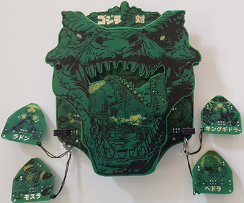](images/BadgeAssembled03.jpg)

[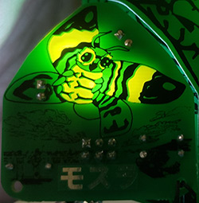](images/Mothra01.jpg)
[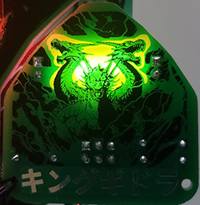](images/KingGhidorah01.jpg)
[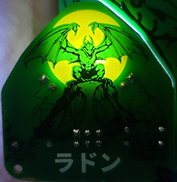](images/Rodan01.jpg)
[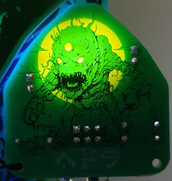](images/Hedorah01.jpg)

Since the ESP Dev board has an embedded battery charge circuit the schematic for the main badge was fairly simple.
The schematic for the SAO PCB had a challenge in that these were to be four seperate circuits but rules checks were complaining about 3V and GND not being connected between them.  I solved this by using four seperate 3V and GND power nets.
The PCB layout and tracing was a challenge due to all the solder mask voids and capacitive touch areas and the fact that there were four seperate PCBs (seven if you consider the SAO PCB breaks out to four) that all had to align perfectly with each other for when they were assembled together.

[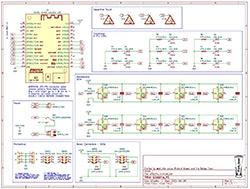](images/g0dzilla_vs_schematic_rev1.jpg)
[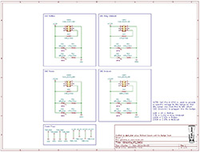](images/g0dzilla_vs_sao1_schematic_rev1.jpg)

[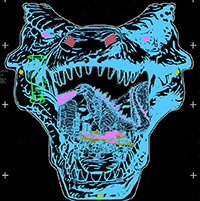](images/g0dzilla_vs_pcb_front_rev1.jpg)
[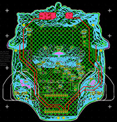](images/g0dzilla_vs_pcb_mid_rev1.jpg)
[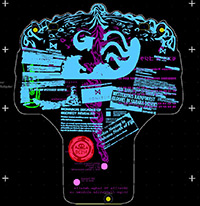](images/g0dzilla_vs_pcb_rear_rev1.jpg)
[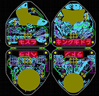](images/g0dzilla_vs_pcb_sao1_rev1.jpg)

# Kit Assembly

Assembly Instructions for the G0dzilla VS Badge kit can be found here: [G0dzilla VS Badge Assembly Instructions](assembly.md)

An assembly video can be found here:
TBD

[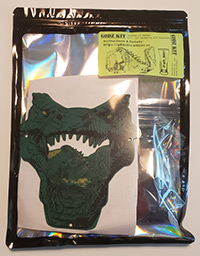](images/BadgeKit01.jpg)
[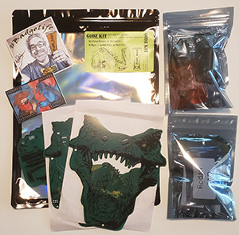](images/BadgeKit02.jpg)
[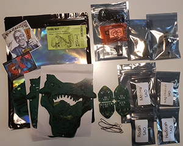](images/BadgeKit03.jpg)

# Badge Operations

Here are the basics for operating the badge.

## Power Switch and Battery Charging

This badge uses an ESP32 Development board with a USB-C connector that is connected to and powered by a LIPO rechargeable battery.

The power switch on the badge is a direct cutoff to the LIPO battery.
So the switch must be in the ON position in order to charge the battery from the dev board.

The switch is on the side of the badge and is in the OFF position when it is closer to the bottom of the badge (down).

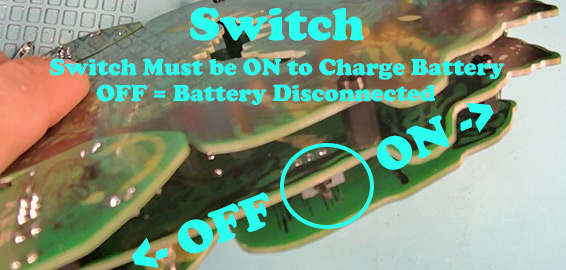

To charge the battery follow these steps:
* Turn the power switch to ON (towards the top of the badge) which will power on the badge if the battery has any charge remaining.  But, even if the badge does not power on the switch should be in the ON position. 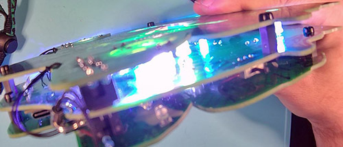
* Plug in a USB-C cable to the badge dev board and apply power either from a PC or wall charger. 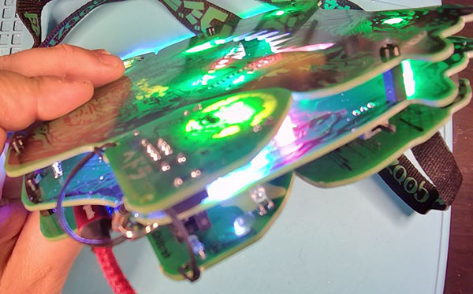
* On the back of the badge you should see the battery charge indicator light lit up.  If it is not then repeat the first two steps to try again.  This indicator light should flash if it does not see a battery connected and will turn off when a connected battery is fully charged. 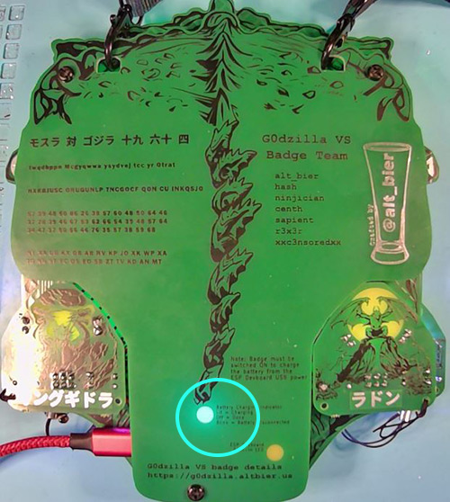
* The powered SAOs on the front of the badge should be removed while charging. 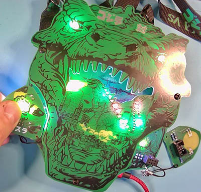
* It should take about 3 to 4 hours to fully charge a battery from fully discharged at which point the battery charge indicator light will turn off.
* Since it can be annoying to have the badge flashing all its LEDs while charging we added a LED-Off mode that can be activated by pressing on the Monarch Logo button (located on the back side of the middle PCB) for a LONG PRESS press of about 20 to 30 seconds. 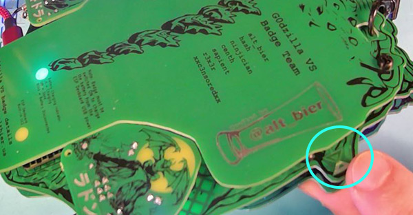
* In the LED-Off mode all the badge LEDs will turn off except for the two on the ESP dev board.  The battery charge indicator light should be on if it charging and the on-board LED will flash once every 20 seconds or so.  The flashing LED is there to tell you the badge is still powered on even if the charge is done and the charge light turns off. This LED mode can be disabled by long pressing the Monarch Logo again or by power cycling the badge (including disconnecting the USB) 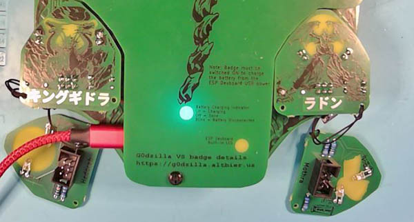

## Touching Godzilla Text - Change badge LED mode

Pressing the word "Godzilla" will change the LED mode.  The default mode color cycles all the neopixels and slowly pulses some of the white LEDs.  There is a battle mode where Godzilla is animated fighting.  Other modes will be added, but these two modes are what is shipping with the badges. 

## Touching VS Text - Boop

Pressing the word "VS" will flash all the white LEDs briefly in a boop effect.

## Touching Monarch Logo - Boop and LED-Off

Pressing the Monarch Logo will flash all the Neopixel LEDs in a random color briefly in a boop effect.

Holding a long press of 20 seconds on the Monarch Logo will enter the LED-Off mode (as explained in the battery charging section above).

## Touching Godzilla Minus One Logo - Boop and Crypto Challenge Mode

Pressing the Godzilla Minus One Logo will flash all the Neopixel LEDs in a random color briefly in a boop effect.

Holding a long press of 20 seconds on the Godzilla Minus One Logo will enter the Cryppto CTF Mode.
This is a crypto challenge game that is launched on a local wireless ap and web server.
When this mode is activated the eyes on the badge will turn solid red and the badge will launch a wireless access point with the name "GDZL-badge-<MAC>" and a web server on 192.168.1.31
Connect to the access point which is open and does not require a password, then browse http://192.168.1.31 to start the crypto challenge.
This Mode can be disabled by long pressing the Godzilla Minus One Logo again or by power cycling the badge.

## Silkscreen Crypto Challenge

In addition to the web based crypto challenge there is an additional crypto challenge built into the silkscreen layer on the back of the badge.
While similar in style and layout of the web based challenge these are seperate challenges that do not depend upon each other for solving.
